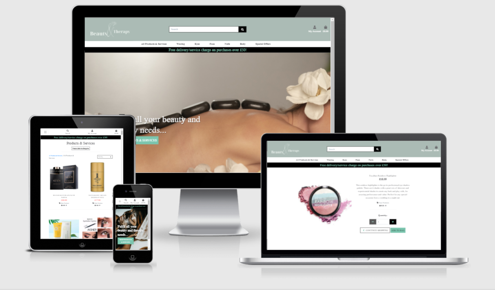

The [Beauty and Therapy Logo](https://beauty-and-therapy.herokuapp.com/) online  web shop is designed to offer beauty services, products, therapies and subscription based treatments. This website is designed to provide a responsive, intuitive and effortless online shopping experience for visitors who wish to view their treatment schedule, book a treatment or purchase a related product all in one place.


## [Table of Contents](#contents)

1. <a name="UX">UX</a>

   - <a name ="project">Project Goals</a>
     - <a name="visitor">Visitor Goals</a>
     - <a name="business">Business Goals</a>
       - Admin and Site Management
   - <a name="user">User Stories</a>
     - Viewing and Navigation
     - Registration and User Accounts
     - Sorting and Searching
     - Purchasing and Checkout
   - <a name="design">Design</a>
   - <a name="wireframes">Wireframes</a>
2. <a name="features">Features</a>
   - <a name="existing">Existing Features</a>
     - <a name="elements">Elements On Every Page</a>
     - <a name="navbar">Navbar</a>
     - <a name="home">Home Page</a>
     - <a name="all">All Products/Services Page</a>
     - <a name="search">Search</a>
     - <a name="detail">Product/Service Detail Page</a>
     - <a name="register">Register Page</a>
     - <a name="login">Login Page</a>
     - <a name="profile">Profile Page</a>
     - <a name="logout">Log out Page</a>
     - <a name="bag">Shopping Bag Page</a>
     - <a name="checkout">Checkout</a>
     - <a name="booking">Service Booking Page</a>
     - <a name="contact">Contact Page</a>
   - <a name="featuresLeft">Features To Implement In Future</a>
3. <a name="info">Information Architecture</a>
   - <a name="choice">Database Choice</a>
   - <a name="models">Data Models</a>
     - <a name="user">User</a>
     - <a name="products">Products App Model</a>
     - <a name="services">Services App Model</a>
4. <a name="tech">Technologies Used</a>
   - <a name="tools">Tools</a>
   - <a name="db">Databases</a>
   - <a name="libraries">Libraries</a>
   - <a name="languages">Languages</a>
5. <a name="testing">Testing</a>
   - See separate<a name="content">Testing.md</a> file
6. <a name="deploy">Deployment</a>
   - <a name="local">How to run this project locally</a>
   - <a name="heroku">Heroku Deployment</a>
7. <a name="credits">Credits</a>
   - <a name="content">Content</a>
   - <a name="media">Media</a>
   - <a name="code">Code</a>
   - <a name="acknowledge">Acknowledgements</a>
8. <a name="contact">Contact</a>

<hr>

## [UX](#ux)

### [Project Goals](#project)

#### [Visitor Goals](#visitor)

The main target audience for Beauty & Therapy are:

- People who want to have the choice of buying a large range of beauty products.
- People that want to schedule a beauty therapy service.
- People who want personal advice on their beauty regime.
- People that would prefer to order online rather than on the high street.
- People who want to keep up with the latest beauty releases.
- people looking for special offers on beauty essentials.

The Beauty & Therapy online shop is a great way to meet these needs because:

- The navigation and user interface resembles the conventions of similar online shops, with product and service images that are clear and of good quality. Details about each product and service are available for the buyer and can be found easily.

- The Beauty & Therapy can also be searched by category or text search so customers can either leisurely browse categories or find specific items/services directly.

  [Back to contents](#contents)

#### [Business Goals](#business)

Admin and Site Management

| ID   | AS A/AN    | I WANT TO BE ABLE TO...       | SO THAT I CAN...                                             |
| ---- | ---------- | ----------------------------- | ------------------------------------------------------------ |
| 1    | Site Owner | Add a product/service         | Add new items to my site                                     |
| 2    | Site Owner | Edit/Update a product/service | Amend prices, descriptions, images or other criteria pertaining to the products/services |
| 3    | Site Owner | Delete a product/service      | Remove items that are no longer required                     |
| 4    | Site Owner | Promote products/services     | Build brand awareness, reach new users and gain a wider audience |

[Back to contents](#contents)

### [User Stories](#user)

Viewing and Navigation

| ID   | AS A/AN  | I WANT TO BE ABLE TO...                                      | SO THAT I CAN...                                             |
| ---- | -------- | ------------------------------------------------------------ | ------------------------------------------------------------ |
| 1    | Customer | Navigate the site easily from any device: desktop, tablet or phone | Have visually appealing content to view that is also useable |
| 2    | Customer | Easily find products/services that are available to purchase | Select some to purchase                                      |
| 3    | Customer | Click on individual products to see the products/services in more detail | See product/service image, description and price             |
| 4    | Customer | Easily identify clearance items/special offers               | Make a saving on products/services i'd like to purchase      |
| 5    | Customer | See a summary of my bag                                      | Keep a track of spending                                     |
| 6    | Customer | Clearly see where to book services once purchased            | Book a treatment/service                                     |

Registration and User Accounts

| ID   | AS A/AN        | I WANT TO BE ABLE TO...                               | SO THAT I CAN...                                             |
| ---- | -------------- | ----------------------------------------------------- | ------------------------------------------------------------ |
| 7    | Account Holder | Easily register for an account                        | Have an account and view my profile details                  |
| 8    | Account Holder | Receive email confirmation of my account registration | Have confirmation of successful registration                 |
| 9    | Account Holder | Login or logout easily                                | Have access to my personal account information               |
| 10   | Account Holder | Recover my password easily in case I forget it        | Gain access to my account                                    |
| 11   | Account Holder | Have a personalised user account                      | View my personal order history, scheduled services, subscriptions and save my payment information |
| 12   | Account Holder | Edit my account details                               | Update my information where necessary                        |

Sorting and Searching

| ID   | AS A/AN  | I WANT TO BE ABLE TO...                                      | SO THAT I CAN...                                             |
| ---- | -------- | ------------------------------------------------------------ | ------------------------------------------------------------ |
| 13   | Customer | Sort the list of available products and services             | Sort products/services by category, best rated  and best price |
| 14   | Customer | Sort a specific category of product/service                  | Sort the products/services I might want to purchase without having to search through the total list of products/services |
| 15   | Customer | Sort products/services that fit into multiple categories     | Find the best-priced or best-rated products/services across broad categories such as "treatments" or "skincare" |
| 16   | Customer | Search for a product by keyword or name                      | Quickly find a specific product or serivce I want to purchase |
| 17   | Customer | See the search results easily and the number of the returned results | Identify whether the product/service that I want is available |

Purchasing and Checkout

| ID   | AS A/AN  | I WANT TO BE ABLE TO...                                      | SO THAT I CAN...                                             |
| ---- | -------- | ------------------------------------------------------------ | ------------------------------------------------------------ |
| 18   | Customer | Select the quantity of products/services easily when purchasing | Verify that I don't order the wrong product/service or quantity |
| 19   | Customer | View items in my bag ready to be purchased                   | View a list of the products/services I will be purchasing and the total cost |
| 20   | Customer | Alter the quantity of individual items in my bag             | Make changes to my bag easily before checkout                |
| 21   | Customer | Feel reassured that my personal details and payment information is safe and secure | Follow the instructions to easily and confidently make a purchase |
| 22   | Customer | View an order summary before completing the purchase         | Verify that I haven't made any mistakes                      |
| 23   | Customer | View an order confirmation after making a purchase           | Verify that the purchase was successful                      |
| 24   | Customer | Receive an email confirmation after checking out             | Retain confirmtation of what I have purchased for my records |
| 25   | Customer | Be able to complete a booking form once my service has been purchased | Book a treatment/service                                     |
| 26   | Customer | Find information on how to cancel an order                   | Cancel an order                                              |

[Back to contents](#contents)

### [Design](#design)

The Beauty & Therapy website has a calming, zen, spa feel to highlight the self care aspect of the products and services available. The following design choices were made with this in mind:

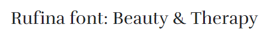

#### Font

- The primary font that was used was 'Rufina' because of it has style but also clear readability. This font also looks good in uppercase, which was used on the buttons of the site. It reflected the relaxed but luxurious nature of the beauty therapy sector.

#### Icons

- To maintain the minimalist design of the site,  icons were used across the site to enhance usability.
- In the navigation bar the **search**, **user** and **shopping bag** icons are conventionally used and would be familiar to the visitors
- The **tag** and **star** icons used for the product categories and product ratings help differentiate them from the rest of the product description
- The **social media** icons in the footer are a familiar, uncluttered way to lead visitors to social media platforms.

#### Colours

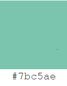


- The colours used for this site were subtle and calming shades to reflect the atmosphere of a spa. The main aqua shade was used to contrast the grey, black and white.
- The pink shade, though still subtle, added a nice contrast to the aqua and grey colours and was used to help the price stand out.

#### Styling

- The hover feature was used to highlight the buttons that were a call to action. 
- The edges of boxes were not rounded to convey the clean, stylish feel of the site. For example, on buttons, the search field and the quantity selector.

[Back to contents](#contents)

### [Wireframes](#wireframes)

These wireframes were created using [Balsamiq](balsamiq.com) during the design and planning part of this project:

- [Home](media/readme/wireframes/home.pdf)
- [Login](media/readme/wireframes/login.pdf)
- [Profile](media/readme/wireframes/profile.pdf)
- [Products](media/readme/wireframes/products.pdf)
- [Product Detail](media/readme/wireframes/product-detail.pdf)
- [Checkout](media/readme/wireframes/checkout.pdf)
- [Booking Form](media/readme/wireframes/booking.pdf)

[Back to contents](#contents)

## [Features](#features)

### [Existing Features](#existing)

#### [Elements On Every Page](#elements)

##### [Navbar](#navbar)


- The navbar features on every page for consistency and ease for the user to traverse the site.
- The Beauty & Therapy logo on the far left links to the site's home page.
- **Desktop**: In the top centre of the desktop view is the search box for quick access to specific text queries.
- On the top right is the **user** and **bag** icons so the user can see their bag total at a glance and have quick access to the user profile, logout and product management if the user is a superuser.
- If the user is not logged in, they will se options to register or log in to the website.
- A user that is not logged in can still add item's to their bag and see a running total, as the bag information is stored in their session data
- Under the search box in the centre are the main categories: All Products & Services, Waxing, Eyes, Face, Nails, Body and Special  Offers. Each heading is a dropdown link that can direct the user to the products and services related to that category, and a link for all of the products and services in that category combined.
- The 'All Products & Services'  dropdown link sorts all the products & services by price, rating and category, as well as a link for all the products and services on the site

- **Mobile and Tablet**: Along the top of the mobile and tablet views is the hamburger menu on the far left, which reveals a dropdown list of all the categories. 

  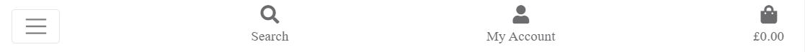

- The **search**, **user** and **bag** icons are the next icons displayed for the user to access the same functions that would be available on the desktop vi

[Home ](#home)

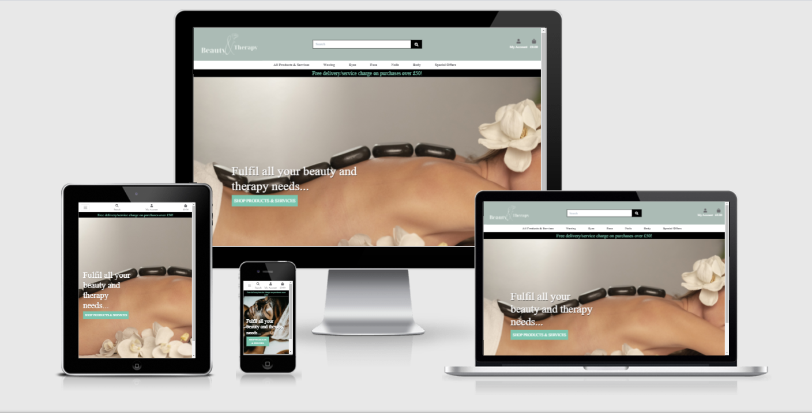	

- The main feature of the home page is a full screen hero image with a call to action button that leads the visitor through to 'All Products & Services'. The image is different for mobiles as the main landscape image used was cropped on mobiles and didn't look as visually appealing.

[Login ](#login)

- The login page can be accessed from the user icon in the navbar. It's functionality has the standard features of requesting username and password
- Validation for this form is handled in the backend and the user will receive the relevant feedback when they sign in

[Logout ](#logout)

- Any user who goes to their user icon and logs out is asked to confirm that is what they wish to do and then they are logged out and the session is cleared. A message will confirm that they are logged out and provides a link to log back in if they want to.

[Register](#register)

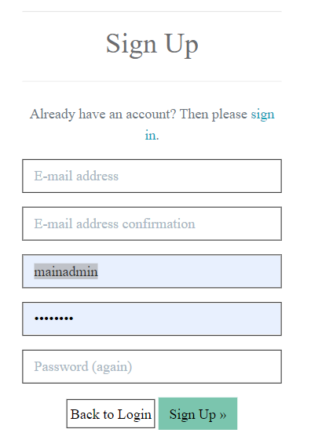	

- A new user can create a new account using the sign up page.
- They need to provide a unique username and add their email address, password and confirm the password.

[All Products/Services ](#all)

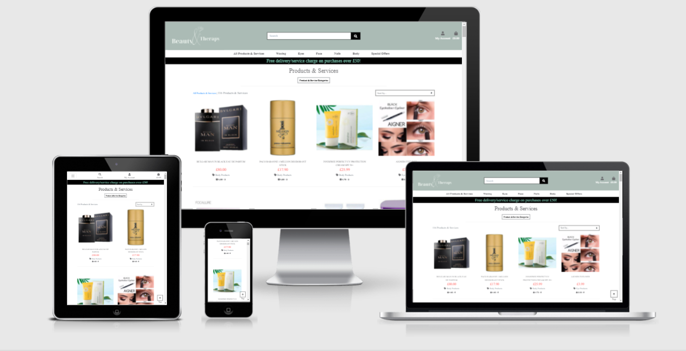	

- 'All Products & Services' is the central hub of the site. The user can find everything available in a neat well presented way. 
- A 'Back to Top' button is a helpful feature as scrolling through so many items can become monotonous.
- The visitor can find a concise summary of the item, as well as the price which is in a contrasting pink colour so that it stands out and is easily seen, while still blending in with the theme.
- As there are an array of items, the background remains plain to maintain focus on the products and services on offer.
- The main heading also reflects what is being shown on the page and changes accordingly. As there is a mix of products and services on the 'All Products & Services' page, the heading says 'Products & Services.'
- The navbar is fixed so that the visitor can always have access to their profile, search bar and the main categories.

[Search](#search)

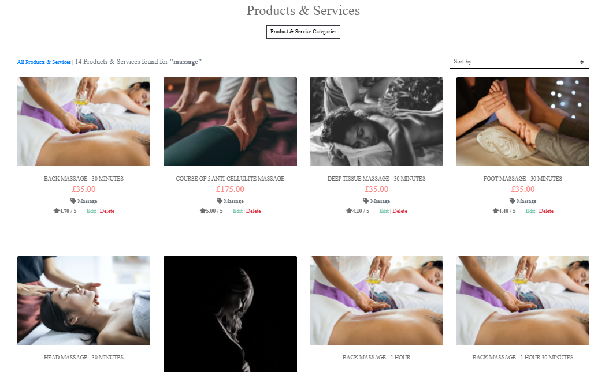	

- The search bar allows the user to search for generic terms if they don't have a specific item in mind. The keyword search will bring up any products or services that contain or are associated with that word.

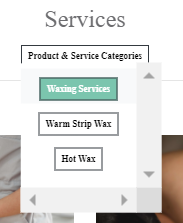

- The drop down button under the main heading is also a quick way for the user to see the products and services the search results can be categorised in.

[Sorting](#sorting)

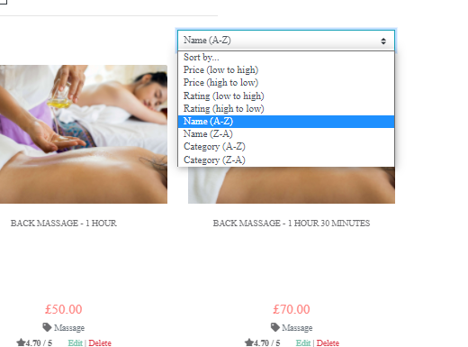	

- Once the user has the received the search results, they can sort them in ascending or descending order by price, rating, name or category. This is helpful for the user to narrow down the search for their product or service.

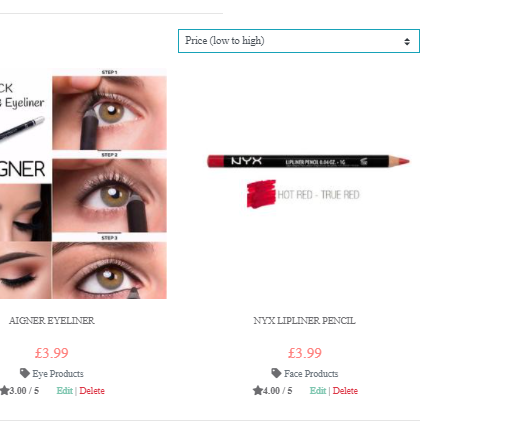	

[Product/Service Detail ](#detail)

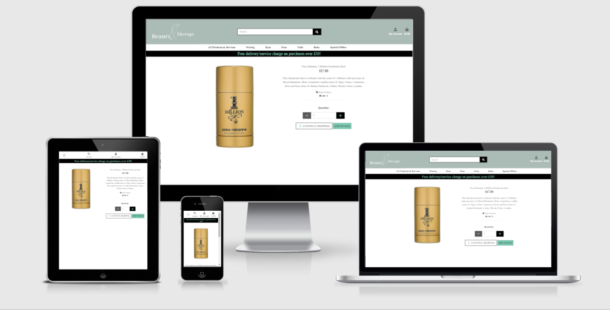	

- If the user has found an item that they are interested in, they can click it's image to get a larger image, a more in-depth description, choose any available options and the quantity if they wish to purchase it.

[Shopping Bag](#bag)

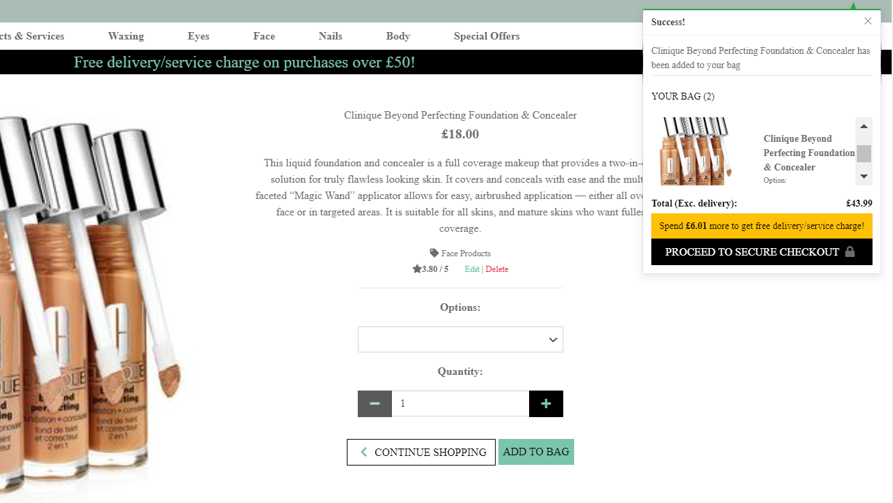	

- Once the user has clicked the 'Add to Bag' button, a handy summary box appears to give the user a quick view of the bag, a count of the items and the bag subtotal and grand total. This is a useful reminder of what is already in the bag and also a prompt for the user to continue on to the checkout.

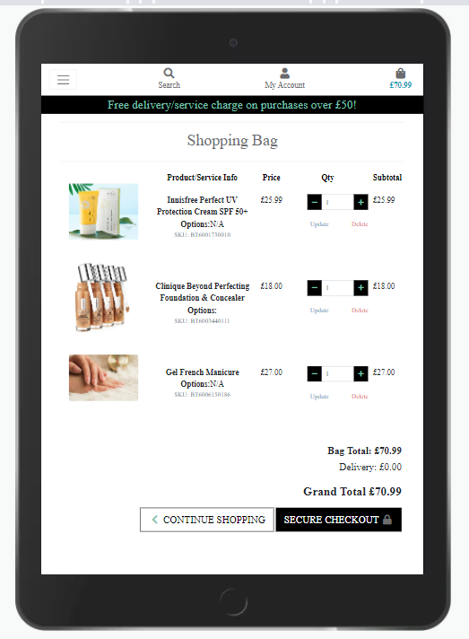	

- Inside the bag, the user will see a list of the items, details, price, quantity, subtotals and grand total. They can also change the quantity and update the bag, delete items, go back to shopping or click the secure checkout button to go to checkout.

[Checkout](#checkout)

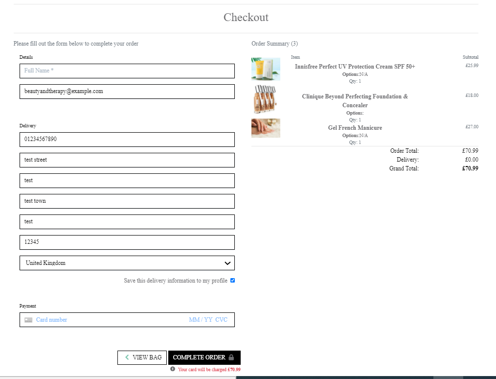	

- Once the user has gone through to checkout, they will see a summary of the bag to ensure at every stage they are still happy to purchase the items, and a form to fill out their details for delivery. There is a handy checkbox so their details can be saved to their profile and next time they wouldn't have to fill out the form.
- The form is fully validated to help ensure the format is completed in the correct format and then all the user has to do to complete the order is enter their details into the payment field. They still have the option to go back to the bag before they enter their details and a highlighted message under the payment field remind the user one last time of the amount of their order.

	

- Once the card details are entered correctly a loading overlay and spinner lets the user know that the order is being processed

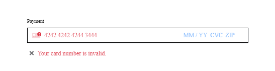	

- Validation on the stripe payment field will prompt the user if the card details are incorrect and therefore avoid errors further down the line.

[Order Confirmation](#order)

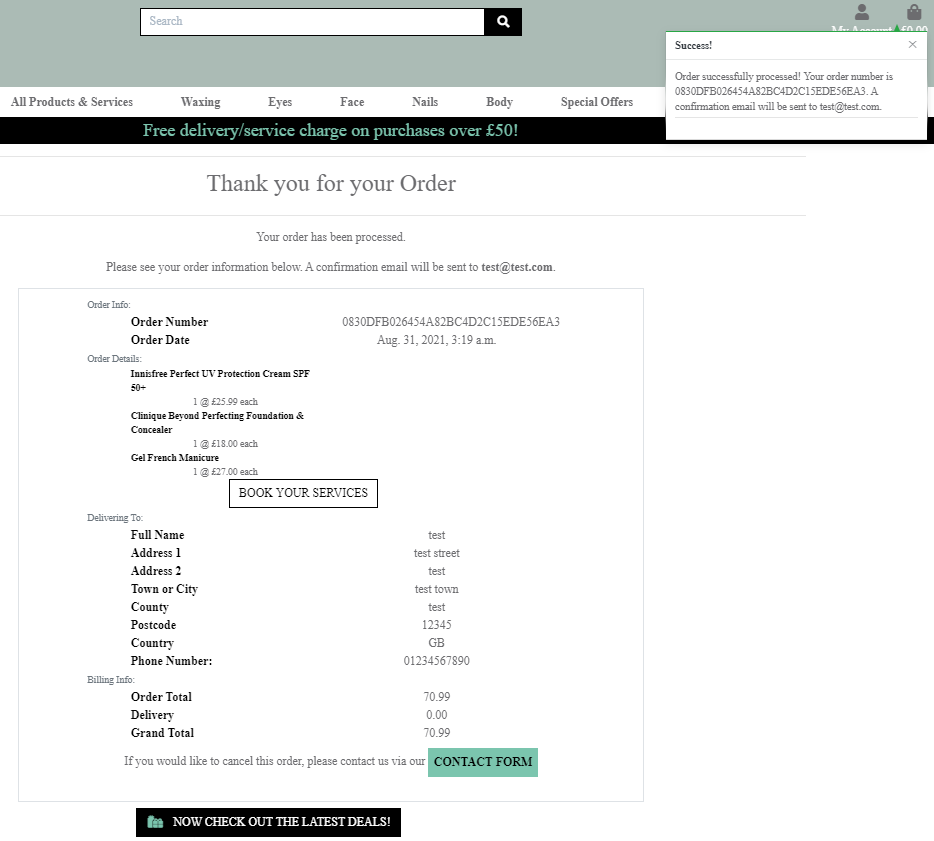	

- Once the order has been processed successfully, the user will be redirected to a message stating that the order has been successful and presenting the user with their confirmed order details. They are also made aware that an email has been sent to them and a message box with a message confirms again that the order has been successful.

[Service Booking](#booking)

	

- If a user's search results bring back only services, the heading will change to reflect that. If a user purchases a service, as seen above on the order confirmation, a 'Book Your Services' button will appear under the details of the service. The button does not appear on a product only order.
- The 'Book Your Services' button prompts the user to go through to the booking page and schedule their service.

[Booking Form](#booking-form)

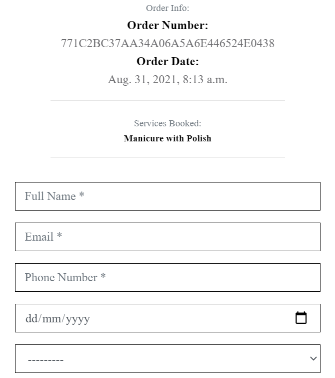	

- Once the user has arrived at the booking form they will see confirmation of the services they have purchased and the related order number and order date.
- They will then complete the rest of the form by selecting the date and time that they wish to schedule their service for.

[Booking Confirmation](#booking-confirm)

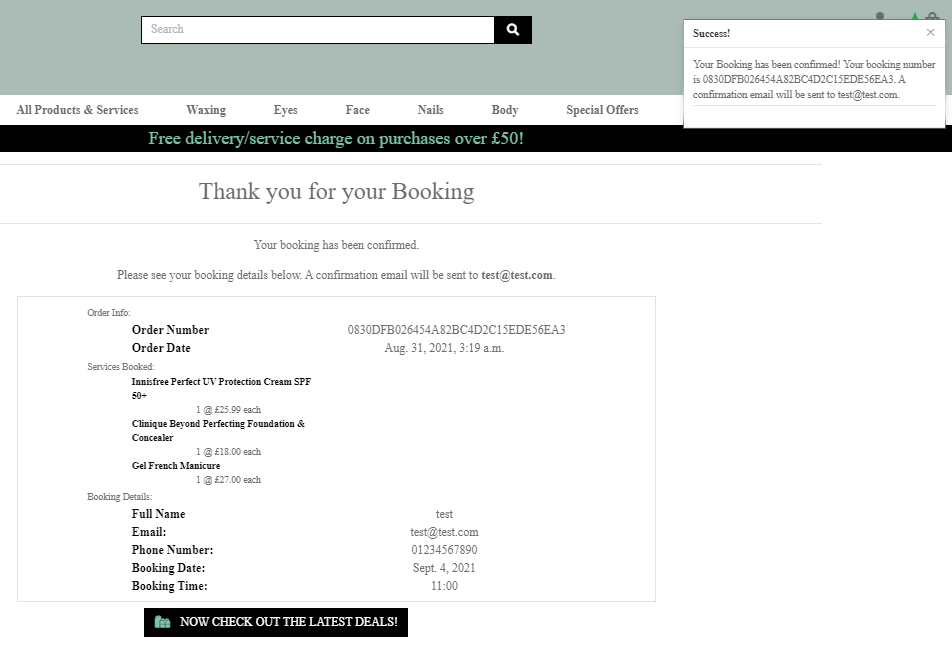	

- Once they click the 'Confirm Booking' button, they will receive another confirmation, and confirmation message pop-up. This time the confirmation will contain the details of the booking that they  just made and the related order details.

[Profile Page](#profile)

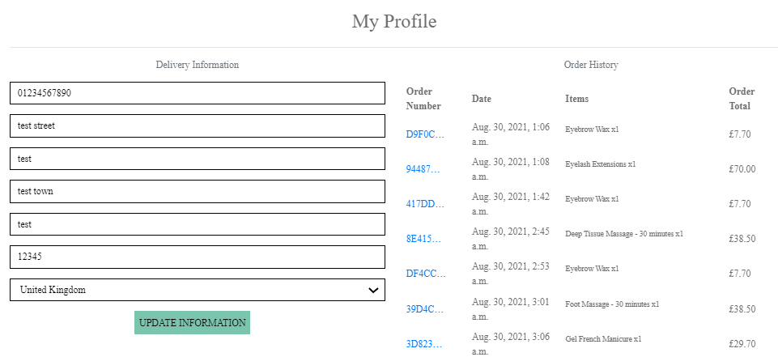	

- If the user has ticked the checkbox to save their information, this will be located in their profile. 
- In the profile they have the option to update their default details and also they can view their order history. 
- If they click a past order, a message pop-up will remind them that it is a past order and how to find the original order details. There is also a handy button to return back to their profile page.

[Product Management](#manage)

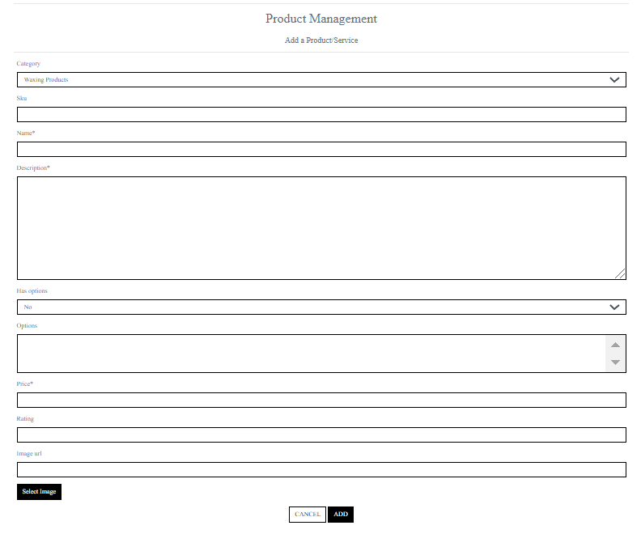	

- The store owner will have special privileges that a user will not have. They can add, edit and delete products and services.
- Only a superuser will see Product Management in their profile dropdown list and edit and delete fields under every product or service item.

[Pages Under Maintenance](#maintain)

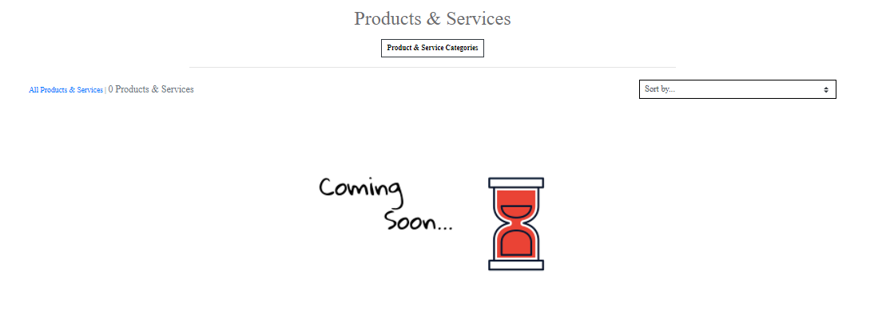	

- There are some categories that may not have any products or services that match. I have rendered a parameter that if that happens, the user will be presented with a 'coming soon image', which is more informative than a blank page.

[Back to contents](#contents)

<a name="featuresLeft">Features To Implement In Future</a>

- Due to time restrictions, I was unable to implement all of the desired features. Given more time I would Link the Booking details to the profile, similar to the order history. This would allow the user to have access to all their booking and user information.
- If multiple services are purchased currently, the user can only book them under one date. In future I would implement the function to have a booking date and time per service that is ordered.
- I would customise the appearance of the date and time pickers so they are more user friendly and prevent the ability to book dates in the past.
- I would add a contact form so the user can get in contact with the site owner directly from the site.
- I would add social media links to improve the reach of the website and improver interaction with users.
- I would add defensive modals so that if a superuser accidentally presses delete they have another chance to retain the items.
- This section will grow as the site is used by real users and issues and needs become more apparent.

1. <a name="info">Information Architecture</a>

   - <a name="choice">Database Choice</a>

     - On deployment, the SQL database provided by Heroku is a **PostgreSQL** database.

   - <a name="models">Data Models</a>

     - <a name="user">User</a>

       The User model utilized for this project is the standard one provided by `django.contrib.auth.models`

     - <a name="products">Products App Model</a>

       Within the `products` app, the **Product** model holds all the data needed for the products and services in the shop. Originally I had products and services in separate models but the pk codes were causing clashes in the bag so I combined them into one overall products app and it worked well.

       **Product model**

       - Category choices are defined within the Product model.
       - The Product model uses Pillow to store all image files in an AWS S3 bucket.

     - <a name="services">Services App Model</a>

       In order to create a Booking form I created a Booking model that used fixtures to implement the BookingTimes model into the crispy form.

     - <a name="options">Options Model</a>

       In order to create add options onto the products, I created an options model that was a many-to-many field so options could be used multiple times on many products.

   <a name="tech">Technologies Used</a>

   - <a name="tools">Tools</a>
     - [Django](https://www.djangoproject.com/) as python web framework for rapid development and clean design.
     - [Stripe](https://stripe.com/) as payment platform to validate and accept credit card payments securely.
     - [AWS S3 Bucket](https://aws.amazon.com/) to store images entered into the database.
     - [Boto3](https://boto3.amazonaws.com/v1/documentation/api/latest/index.html) to enable creation, configuration and management of AWS S3.
     - [Django Crispy Forms](https://django-crispy-forms.readthedocs.io/en/latest/) to style django forms.
     - [Django Heroku](https://pypi.org/project/django-heroku/) to improve deployment of django projects on heroku.
     - [Django Storages](https://django-storages.readthedocs.io/en/latest/) a collection of custom storage backends with django to work with boto3 and AWS S3.
     - [Gunicorn](https://pypi.org/project/gunicorn/) WSGI HTTP Server for UNIX to aid in deployment of the Django project to heroku.
     - [Pillow](https://pillow.readthedocs.io/en/stable/) as python imaging library to aid in processing image files to store in database.
     - [Psycopg2](https://pypi.org/project/psycopg2/) as PostgreSQL database adapter for Python.
     - [PIP](https://pip.pypa.io/en/stable/installing/) for installation of tools needed in this project.
     - [Git](https://gist.github.com/derhuerst/1b15ff4652a867391f03) to handle version control.
     - [GitHub](https://github.com/) to store and share all project code remotely.
     - [Balsamiq](https://balsamiq.com/) to create the wireframes for this project.
   - <a name="db">Databases</a>
     - [PostgreSQL](https://www.postgresql.org/) for production database, provided by heroku.
     - [SQlite3](https://www.sqlite.org/index.html) for development database, provided by django.
   - <a name="libraries">Libraries</a>
     - [JQuery](https://jquery.com/) to simplify DOM manipulation.
     - [Bootstrap](https://www.bootstrapcdn.com/) to simplify the structure of the website and make the website responsive easily.
     - [FontAwesome](https://www.bootstrapcdn.com/fontawesome/) to provide icons for The House of Mouse webshop.
     - [Google Fonts](https://fonts.google.com/) to style the website fonts.
   - <a name="languages">Languages</a>
     - This project uses HTML, CSS, JavaScript and Python programming languages.

   <a name="testing">Testing</a>

   - See separate<a name="content">Testing.md</a> file

   <a name="deploy">Deployment</a>

   - <a name="local">How to run this project locally</a>

     To run this project on your own IDE follow the instructions below:

     Ensure you have the following tools: - An IDE such as [Visual Studio Code](https://code.visualstudio.com/)

     The following **must be installed** on your machine: - [PIP](https://pip.pypa.io/en/stable/installing/) - [Python 3](https://www.python.org/downloads/) - [Git](https://gist.github.com/derhuerst/1b15ff4652a867391f03)

     To allow you to access all functionality on the site locally, ensure you have created free accounts with the following services: - [Stripe](https://dashboard.stripe.com/register) - [AWS](https://aws.amazon.com/) and [set up an S3 bucket](https://docs.aws.amazon.com/AmazonS3/latest/gsg/CreatingABucket.html) - [emailjs](https://www.emailjs.com/)

     Please click the links above for documentation on how to set these up and retrieve the necessary environment variables.

     ### Instructions

     1. Save a copy of the github repository located at https://github.com/Shoreenb/beauty_and_therapy by clicking the "download zip" button at the top of the page and extracting the zip file to your chosen folder. If you have Git installed on your system, you can clone the repository with the following command.

        ```
        git clone https://github.com/shoreenb/beauty_and_therapy
        ```

     2. Open your preferred IDE, open a terminal session in the unzip folder or cd to the correct location.

     3. A virtual environment is recommended for the Python interpreter, I recommend using Pythons built in virtual environment. Enter the command:

        ```
        python -m .venv venv
        ```

     *NOTE: The `python` part of this command and the ones in other steps below assumes you are working with a windows operating system. Your Python command may differ, such as `python3` or `py`*

     1. Activate the .venv with the command:

        ```
        .venv\Scripts\activate 
        ```

     *Again this **command may differ depending on your operating system**, please check the [Python Documentation on virtual environments](https://docs.python.org/3/library/venv.html) for further instructions.*

     1. If needed, Upgrade pip locally with

        ```
        pip install --upgrade pip.
        ```

     2. Install all required modules with the command

        ```
        pip -r requirements.txt.
        ```

     3. Set up the following environment variables within your IDE.

        - If using VSCode, locate the `settings.json` file within the .vscode directory and add your environment variables as below. Do not forget to restart your machine to activate your environment variables or your code will not be able to see them:

        ```
        "terminal.integrated.env.windows": {
            "HOSTNAME": "<enter hostname here>",
            "DEV": "1",
            "SECRET_KEY": "<enter key here>",
            "STRIPE_PUBLISHABLE": "<enter key here>",
            "STRIPE_SECRET": "<enter key here>",
            "EMAILJS_USER_ID": "<enter key here>",
            "STRIPE_SUCCESS_URL": "<enter url here>",
            "STRIPE_CANCEL_URL": "<enter url here>",
            "AWS_ACCESS_KEY_ID": "<enter key here>",
            "AWS_SECRET_ACCESS_KEY": "<enter key here>",
            "AWS_STORAGE_BUCKET_NAME": "<enter bucket name here>",
        }
        ```

        - If using an IDE that includes a `bashrc` file, open this file and enter all the environment variables listed above using the following format:

        ```
        HOSTNAME="<enter key here>"
        ```

        - `HOSTNAME` should be the local address for the site when running within your own IDE.
        - `DEV` environment variable is set only within the development environment, it does not exist in the deployed version, making it possible to have different settings for the two environments. For example setting DEBUG to True only when working in development and not on the deployed site.

     4. If you have restarted your machine to activate your environment variables, do not forget to reactivate your virtual environment with the command used at step 4.

     5. Migrate the admin panel models to create your database template with the terminal command

        ```
        python manage.py migrate
        ```

     6. Create your superuser to access the django admin panel and database with the following command, and then follow the steps to add your admin username and password:

        ```
        python manage.py createsuperuser
        ```

     7. You can now run the program locally with the following command:

        ```
        python manage.py runserver
        ```

     8. Once the program is running, go to the local link provided and add `/admin` to the end of the ur. Here log in with your superuser account and create instances of ShippingDestination and Product within the new database.

     9. Once instances of these items exist in your database your local site will run as expected.

   - <a name="heroku">Heroku Deployment</a>

     To deploy Beauty & Therapy site to heroku, take the following steps:

     1. Create a `requirements.txt` file using the terminal command `pip freeze > requirements.txt`.
     2. Create a `Procfile` with the terminal command `echo web: python app.py > Procfile`.
     3. `git add` and `git commit` the new requirements and Procfile and then `git push` the project to GitHub.
     4. Create a new app on the [Heroku website](https://dashboard.heroku.com/apps) by clicking the "New" button in your dashboard. Give it a name and set the region to whichever is applicable for your location.
     5. From the heroku dashboard of your newly created application, click on "Deploy" > "Deployment method" and select GitHub.
     6. Confirm the linking of the heroku app to the correct GitHub repository.
     7. In the heroku dashboard for the application, click on "Settings" > "Reveal Config Vars".
     8. Set the following config vars:

     | Key                     | Value                                         |
     | ----------------------- | --------------------------------------------- |
     | AWS_ACCESS_KEY_ID       | `<your secret key>`                           |
     | AWS_SECRET_ACCESS_KEY   | `<your secret key>`                           |
     | AWS_STORAGE_BUCKET_NAME | `<your AWS S3 bucket name>`                   |
     | DATABASE_URL            | `<your postgres database url>`                |
     | EMAILJS_USER_ID         | `<your secret key>`                           |
     | HOSTNAME                | `<your heroku app hostname>`                  |
     | SECRET_KEY              | `<your secret key>`                           |
     | STRIPE_CANCEL_URL       | `<link to all-products page in your app>`     |
     | STRIPE_PUBLISHABLE      | `<your secret key>`                           |
     | STRIPE_SECRET           | `<your secret key>`                           |
     | STRIPE_SUCCESS_URL      | `<link to checkout/confirm page in your app>` |

     1. From the command line of your local IDE:

        - Enter the heroku postres shell
        - Migrate the database models
        - Create your superuser account in your new database

        Instructions on how to do these steps can be found in the [heroku devcenter documentation](https://devcenter.heroku.com/articles/heroku-postgresql).

     2. In your heroku dashboard, click "Deploy". Scroll down to "Manual Deploy", select the master branch then click "Deploy Branch".

     3. Once the build is complete, click the "View app" button provided.

     4. From the link provided add `/admin` to the end of the url, log in with your superuser account and create instances of ShippingDestination and Product within the new database.

     5. Once instances of these items exist in your database your heroku site will run as expected.

2. <a name="credits">Credits</a>

   - <a name="content">Content</a>

     The main structure of the project was based on the boutique ado project with the assistance of tutor support and django docs to help formulate my unique options model and booking model.

   - <a name="media">Media</a>

     **Media Images**:

     Nail technician Image by <a href="https://pixabay.com/users/spabielenda-15378103/?utm_source=link-attribution&amp;utm_medium=referral&amp;utm_campaign=image&amp;utm_content=5529805">spabielenda</a> from <a href="https://pixabay.com/?utm_source=link-attribution&amp;utm_medium=referral&amp;utm_campaign=image&amp;utm_content=5529805">Pixabay</a>

     Massage Image by <a href="https://pixabay.com/users/mariolh-62451/?utm_source=link-attribution&amp;utm_medium=referral&amp;utm_campaign=image&amp;utm_content=567021">Mariolh</a> from <a href="https://pixabay.com/?utm_source=link-attribution&amp;utm_medium=referral&amp;utm_campaign=image&amp;utm_content=567021">Pixabay</a>

     Mud mask Image by <a href="https://pixabay.com/users/olyalole-13609797/?utm_source=link-attribution&amp;utm_medium=referral&amp;utm_campaign=image&amp;utm_content=4481538">Olya Lolé</a> from <a href="https://pixabay.com/?utm_source=link-attribution&amp;utm_medium=referral&amp;utm_campaign=image&amp;utm_content=4481538">Pixabay</a>

     Eyelash Image by <a href="https://pixabay.com/users/agustino-657354/?utm_source=link-attribution&amp;utm_medium=referral&amp;utm_campaign=image&amp;utm_content=2901096">agustino</a> from <a href="https://pixabay.com/?utm_source=link-attribution&amp;utm_medium=referral&amp;utm_campaign=image&amp;utm_content=2901096">Pixabay</a>

     Hot stones Image by <a href="https://pixabay.com/users/engin_akyurt-3656355/?utm_source=link-attribution&amp;utm_medium=referral&amp;utm_campaign=image&amp;utm_content=5578598">Engin Akyurt</a> from <a href="https://pixabay.com/?utm_source=link-attribution&amp;utm_medium=referral&amp;utm_campaign=image&amp;utm_content=5578598">Pixabay</a>

     Nail varnish Image by <a href="https://pixabay.com/users/beauty_and_pastels-4386441/?utm_source=link-attribution&amp;utm_medium=referral&amp;utm_campaign=image&amp;utm_content=2171194">Marion Müller</a> from <a href="https://pixabay.com/?utm_source=link-attribution&amp;utm_medium=referral&amp;utm_campaign=image&amp;utm_content=2171194">Pixabay</a>

     opi nail varnish Photo by [Cut Collective](https://unsplash.com/@cutcollective?utm_source=unsplash&utm_medium=referral&utm_content=creditCopyText) on [Unsplash](https://unsplash.com/s/photos/beauty-therapist?utm_source=unsplash&utm_medium=referral&utm_content=creditCopyText)  

     Nail and flowers Image by <a href="https://pixabay.com/users/susiwusi-690574/?utm_source=link-attribution&amp;utm_medium=referral&amp;utm_campaign=image&amp;utm_content=3258987">Susi Anderl</a> from <a href="https://pixabay.com/?utm_source=link-attribution&amp;utm_medium=referral&amp;utm_campaign=image&amp;utm_content=3258987">Pixabay</a>

     Foot spa Image by <a href="https://pixabay.com/users/3220633-3220633/?utm_source=link-attribution&amp;utm_medium=referral&amp;utm_campaign=image&amp;utm_content=5663021">3220633</a> from <a href="https://pixabay.com/?utm_source=link-attribution&amp;utm_medium=referral&amp;utm_campaign=image&amp;utm_content=5663021">Pixabay</a>

     Face Image by <a href="https://pixabay.com/users/silviarita-3142410/?utm_source=link-attribution&amp;utm_medium=referral&amp;utm_campaign=image&amp;utm_content=3141766">silviarita</a> from <a href="https://pixabay.com/?utm_source=link-attribution&amp;utm_medium=referral&amp;utm_campaign=image&amp;utm_content=3141766">Pixabay</a>

     Mud mask Image by <a href="https://pixabay.com/users/olyalole-13609797/?utm_source=link-attribution&amp;utm_medium=referral&amp;utm_campaign=image&amp;utm_content=4481538">Olya Lolé</a> from <a href="https://pixabay.com/?utm_source=link-attribution&amp;utm_medium=referral&amp;utm_campaign=image&amp;utm_content=4481538">Pixabay</a>

     Eyelash Photo by [Nataliya Vaitkevich](https://www.pexels.com/@n-voitkevich?utm_content=attributionCopyText&utm_medium=referral&utm_source=pexels) from [Pexels](https://www.pexels.com/photo/woman-in-white-shirt-holding-baby-5128222/?utm_content=attributionCopyText&utm_medium=referral&utm_source=pexels)

     Eyebrow tinting Photo by [Anthony Shkraba](https://www.pexels.com/@shkrabaanthony?utm_content=attributionCopyText&utm_medium=referral&utm_source=pexels) from [Pexels](https://www.pexels.com/photo/woman-in-black-and-white-stripe-shirt-5178001/?utm_content=attributionCopyText&utm_medium=referral&utm_source=pexels)

     photo measuring eyebrow by [diana.grytsku](https://www.freepik.com/photos/hand) from [freepik](www.freepik.com)

     photo of woman with facial wax created by [freepik](https://www.freepik.com/photos/woman) 

     threading photo by [Rune Enstad](https://unsplash.com/@runejohs?utm_source=unsplash&utm_medium=referral&utm_content=creditCopyText) on [Unsplash](https://unsplash.com/s/photos/beauty-therapist?utm_source=unsplash&utm_medium=referral&utm_content=creditCopyText)  

     varnish removal Photo by [cottonbro](https://www.pexels.com/@cottonbro?utm_content=attributionCopyText&utm_medium=referral&utm_source=pexels)from [Pexels](https://www.pexels.com/photo/person-holding-black-hand-spinner-3997391/?utm_content=attributionCopyText&utm_medium=referral&utm_source=pexels)

     Semi Permanent Makeup Photo by [Gabe Pierce](https://unsplash.com/@gaberce?utm_source=unsplash&utm_medium=referral&utm_content=creditCopyText) on [Unsplash](https://unsplash.com/s/photos/tattoo-eyebrow?utm_source=unsplash&utm_medium=referral&utm_content=creditCopyText)  

     Hot wax Photo by [Kate Hliznitsova](https://unsplash.com/@kate_gliz?utm_source=unsplash&utm_medium=referral&utm_content=creditCopyText) on [Unsplash](https://unsplash.com/s/photos/waxing?utm_source=unsplash&utm_medium=referral&utm_content=creditCopyText)  

     image of beauty therapist with hot wax created by [prostooleh](https://www.freepik.com/photos/hand) on [freepik](www.freepik.com)

     Head massage Photo by [Andrea Piacquadio](https://www.pexels.com/@olly?utm_content=attributionCopyText&utm_medium=referral&utm_source=pexels) from [Pexels](https://www.pexels.com/photo/selective-focus-photo-of-woman-getting-a-head-massage-3760270/?utm_content=attributionCopyText&utm_medium=referral&utm_source=pexels)

     leg massage Photo by [Conscious Design](https://unsplash.com/@conscious_design?utm_source=unsplash&utm_medium=referral&utm_content=creditCopyText) on [Unsplash](https://unsplash.com/s/photos/foot-massage?utm_source=unsplash&utm_medium=referral&utm_content=creditCopyText)  

     foot massage Photo by [Anete Lusina](https://www.pexels.com/@anete-lusina?utm_content=attributionCopyText&utm_medium=referral&utm_source=pexels) from [Pexels](https://www.pexels.com/photo/crop-therapist-massaging-foot-of-client-5240677/?utm_content=attributionCopyText&utm_medium=referral&utm_source=pexels)

     Deep tissue Photo by [Ale Romo Photography](https://unsplash.com/@aleromophotography?utm_source=unsplash&utm_medium=referral&utm_content=creditCopyText) on [Unsplash](https://unsplash.com/s/photos/deep-tissue-massage?utm_source=unsplash&utm_medium=referral&utm_content=creditCopyText)  

     Prenatal massagePhoto by [🇸🇮 Janko Ferlič](https://unsplash.com/@itfeelslikefilm?utm_source=unsplash&utm_medium=referral&utm_content=creditCopyText) on [Unsplash](https://unsplash.com/s/photos/prenatal-massage?utm_source=unsplash&utm_medium=referral&utm_content=creditCopyText)  

     massage oil Photo by [alan caishan](https://unsplash.com/@caishan119?utm_source=unsplash&utm_medium=referral&utm_content=creditCopyText) on [Unsplash](https://unsplash.com/s/photos/manipulate-the-muscles?utm_source=unsplash&utm_medium=referral&utm_content=creditCopyText)  

     nail varnish Images by <a href="https://pixabay.com/users/bru-no-1161770/?utm_source=link-attribution&amp;utm_medium=referral&amp;utm_campaign=image&amp;utm_content=870857">Bruno /Germany</a> from <a href="https://pixabay.com/?utm_source=link-attribution&amp;utm_medium=referral&amp;utm_campaign=image&amp;utm_content=870857">Pixabay</a>

     face mask Image by <a href="https://pixabay.com/users/adorebeautynz-14675004/?utm_source=link-attribution&amp;utm_medium=referral&amp;utm_campaign=image&amp;utm_content=4713578">AdoreBeautyNZ</a> from <a href="https://pixabay.com/?utm_source=link-attribution&amp;utm_medium=referral&amp;utm_campaign=image&amp;utm_content=4713578">Pixabay</a>

     eye cream Image by <a href="https://pixabay.com/users/leyajacob-3298797/?utm_source=link-attribution&amp;utm_medium=referral&amp;utm_campaign=image&amp;utm_content=1755428">leyajacob</a> from <a href="https://pixabay.com/?utm_source=link-attribution&amp;utm_medium=referral&amp;utm_campaign=image&amp;utm_content=1755428">Pixabay</a>

     cosmetics Image by <a href="https://pixabay.com/users/pmvchamara-890817/?utm_source=link-attribution&amp;utm_medium=referral&amp;utm_campaign=image&amp;utm_content=4993472">pmvchamara .com</a> from <a href="https://pixabay.com/?utm_source=link-attribution&amp;utm_medium=referral&amp;utm_campaign=image&amp;utm_content=4993472">Pixabay</a>

     Hand cream Image by <a href="https://pixabay.com/users/missanonymissm-13983129/?utm_source=link-attribution&amp;utm_medium=referral&amp;utm_campaign=image&amp;utm_content=4717325">Anastasia Oliver</a> from <a href="https://pixabay.com/?utm_source=link-attribution&amp;utm_medium=referral&amp;utm_campaign=image&amp;utm_content=4717325">Pixabay</a>

     beauty product images by Rebecca Tan from [kaggle.com](https://www.kaggle.com/rebstan97/beauty-image)

     Hand and nail Photo by [Chelson Tamares](https://unsplash.com/@jd_chon?utm_source=unsplash&utm_medium=referral&utm_content=creditCopyText) on [Unsplash](https://unsplash.com/s/photos/foot-spa?utm_source=unsplash&utm_medium=referral&utm_content=creditCopyText)  

     manicure Photo by [cottonbro](https://www.pexels.com/@cottonbro?utm_content=attributionCopyText&utm_medium=referral&utm_source=pexels) from [Pexels](https://www.pexels.com/photo/person-in-black-leather-gloves-holding-red-nail-polish-3997389/?utm_content=attributionCopyText&utm_medium=referral&utm_source=pexels)

     leg Photo by [Lucrezia Carnelos](https://unsplash.com/@ciabattespugnose?utm_source=unsplash&utm_medium=referral&utm_content=creditCopyText) on [Unsplash](https://unsplash.com/s/photos/waxing?utm_source=unsplash&utm_medium=referral&utm_content=creditCopyText)  

     Strip wax Photo by [The Creative Exchange](https://unsplash.com/@thecreative_exchange?utm_source=unsplash&utm_medium=referral&utm_content=creditCopyText) on [Unsplash](https://unsplash.com/s/photos/waxing?utm_source=unsplash&utm_medium=referral&utm_content=creditCopyText)  

     Grey cross Image by <a href="https://pixabay.com/users/thedigitalartist-202249/?utm_source=link-attribution&amp;utm_medium=referral&amp;utm_campaign=image&amp;utm_content=6026650">Pete Linforth</a> from <a href="https://pixabay.com/?utm_source=link-attribution&amp;utm_medium=referral&amp;utm_campaign=image&amp;utm_content=6026650">Pixabay</a>

     Coming soon Image by <a href="https://pixabay.com/users/parveender-5611058/?utm_source=link-attribution&amp;utm_medium=referral&amp;utm_campaign=image&amp;utm_content=4721933">Parveender Lamba</a> from <a href="https://pixabay.com/?utm_source=link-attribution&amp;utm_medium=referral&amp;utm_campaign=image&amp;utm_content=4721933">Pixabay</a>

     [Kaggle](kaggle.com) provided the beauty product images(beauty_image)

     

     <a name="acknowledge">Acknowledgements</a>

     Special thanks to my mentor Gerard McBride for his time, expertise and knowledge through my entire journey through the CodeInstitute full stack web development course.

     With thanks also the many tutor support tutors who helped troubleshoot and debug, saved me from giving up, the endless support of my family who supported me and all the slack volunteers who assisted and encouraged me along the way.

